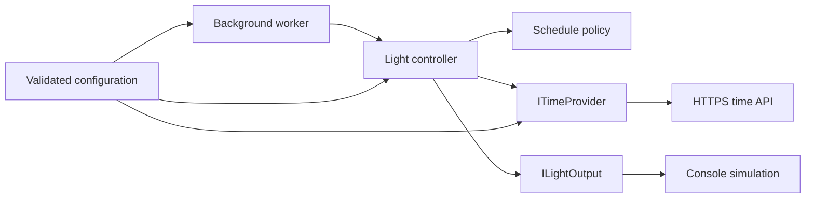

# Smart Light Controller

A fault-tolerant .NET smart-light simulation that applies configurable schedules and enters a safe state when its time source repeatedly fails.

[](https://github.com/DenGian/smart-light-controller/actions/workflows/ci.yml)

## Why this project exists

This compact reference project explores reliable automation logic: dependency inversion around external time and output boundaries, schedules that cross midnight, deterministic testing, and recovery after transient failures. It deliberately stays small enough for the control behavior and trade-offs to remain visible.

## Capabilities

- Configurable same-day or overnight active windows.
- Inclusive start and exclusive end boundaries.
- Consecutive time-source failure tracking.
- Safe-mode shutdown at a validated failure threshold.
- Automatic recovery after the next successful time read.
- Cancellable background execution and structured logs.
- A console-logged simulated light output.
- Unit, self-contained integration, and acceptance tests.

## Architecture



`LightController` owns failure state and coordinates decisions with side effects. `LightSchedule` is a pure scheduling policy. `ITimeProvider` and `ILightOutput` keep network access and output behavior replaceable. The hosted worker runs one check immediately, then uses `PeriodicTimer` until application cancellation. See [the architecture notes](docs/architecture.md) for the main design decisions.

## Scheduling semantics

For a same-day window such as `08:00`–`12:00`, the light is active from 08:00 inclusive until 12:00 exclusive. For an overnight window such as `20:00`–`06:00`, it is active on both sides of midnight. Equal start and end times define an empty schedule, so the light remains off.

## Failure and recovery behavior

A failed time read preserves the current light state while the consecutive-failure count remains below the threshold. At the threshold, the controller enters safe mode and turns the light off. A successful read resets the count, exits safe mode, and immediately applies the configured schedule. Cancellation is allowed to propagate and does not count as a failure.

## Technology

- C# and .NET 10 LTS
- .NET Generic Host, dependency injection, options, and logging
- `HttpClient` and `System.Text.Json`
- xUnit and coverlet
- GitHub Actions and Dependabot

## Getting started

Prerequisite: a .NET 10 SDK compatible with `global.json`.

```bash
dotnet restore
dotnet build --configuration Release --no-restore
dotnet run --project SmartLightSystem
```

Stop the demo with Ctrl+C. The normal test suite is entirely local and does not contact the configured time service:

```bash
dotnet test --configuration Release
```

Collect coverage without enforcing a vanity threshold:

```bash
dotnet test --configuration Release --collect:"XPlat Code Coverage" --results-directory artifacts/coverage
```

## Configuration

Settings live under `SmartLight` in `SmartLightSystem/appsettings.json`. They can also be overridden with standard .NET configuration providers—for example, `SmartLight__PollingInterval=00:00:30` as an environment variable.

| Setting | Default | Purpose |
| --- | --- | --- |
| `ActiveStart` | `20:00:00` | Inclusive start of the active window |
| `ActiveEnd` | `06:00:00` | Exclusive end of the active window |
| `MaxConsecutiveFailures` | `3` | Failures before safe mode; must be at least 1 |
| `PollingInterval` | `00:00:05` | Delay between controller checks; must be positive |
| `TimeZoneId` | `Europe/Brussels` | Time-zone path sent to the configured provider |
| `TimeServiceBaseUri` | `https://worldtimeapi.org/api/timezone/` | HTTPS base URI for time reads; must end with `/` |
| `HttpTimeout` | `00:00:05` | Bounded HTTP request timeout; must be positive |

Invalid configuration fails during startup with a descriptive options-validation error.

## Testing strategy

- Unit tests exercise schedule boundaries, overnight behavior, configuration validation, failure counting, idempotent output changes, cancellation, safe mode, and recovery.
- Integration tests exercise the actual HTTP provider through an in-process message handler, including status errors, malformed data, timeout, cancellation, and transient recovery.
- Acceptance tests express end-to-end controller scenarios using deterministic in-memory boundaries.

No test requires Mockoon, internet access, wall-clock timing, or a manually started process.

## Limitations

- No physical-device adapter is included; the supplied output is only a console simulation.
- Runtime time accuracy and availability depend on the configured external provider.
- The controller supports one daily window, not calendars, exceptions, or multiple devices.
- This is a portfolio/reference implementation, not a production home-automation platform.

## Possible extensions

- Add an adapter for a specific physical device behind `ILightOutput`.
- Add a local-clock or NTP-backed time provider.
- Support richer scheduling rules.
- Expose health and operational metrics.

## License

Licensed under the [MIT License](LICENSE). Copyright © 2026 Ian Mondelaers.
