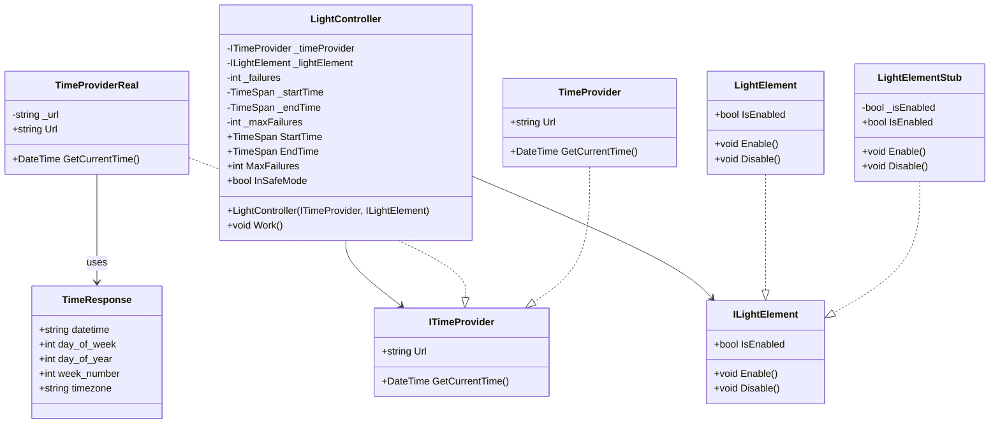

# SmartLight System Design Documentation

## Table of Contents
* [Overview](#overview)
* [System Design Process](#system-design-process)
* [Architecture](#architecture)
* [Test Design & Implementation](#test-design--implementation)
* [Implementation Details](#implementation-details)
* [Test-Driven Development Approach](#test-driven-development-approach)

## Overview
The SmartLight System is designed to provide automated light control based on time of day. It emphasizes reliability, safety, and maintainability through robust error handling and clear separation of concerns.

### Key Features
* Time-based light control
* Automatic overnight handling
* Fault tolerance with safe mode
* Configurable time windows
* API-based time synchronization

## System Design Process

### Initial Analysis
The system was designed through a systematic approach:

1. **Requirements Analysis**
* Need for time-based control
* Requirement for fault tolerance
* API integration necessity
* Testing requirements

2. **Design Decisions**
* Separation into three main components
* Use of interfaces for dependency injection
* Implementation of safe mode
* Error threshold mechanism

3. **Pattern Selection**
* Repository pattern for time retrieval
* Strategy pattern for light control
* Factory pattern potential for future extensions

## Architecture

### Core Components

1. LightController (Decision Module)
* **Purpose**: Central decision-making component
* **Responsibilities**:
    * Time-based light state management
    * Failure handling and recovery
    * Safe mode management
* **Key Methods**:
    * `Work()`: Main control loop
    * Property accessors for configuration

2. ITimeProvider (Information Provider)
* **Purpose**: Time information abstraction
* **Responsibilities**:
    * Time retrieval from external sources
    * URL configuration
* **Implementations**:
    * `TimeProviderReal`: Production implementation
    * `TimeProviderStub`: Testing implementation

3. ILightElement (Action Module)
* **Purpose**: Light control abstraction
* **Responsibilities**:
    * Light state management
    * Hardware interaction abstraction
* **Implementations**:
    * `LightElementStub`: Testing implementation
    * Future real hardware implementations

### Class Diagram

## Test Design & Implementation

### ZOMBIES Testing Strategy

#### Zero Tests

##### 1. Work_WhenStartTimeEqualsEndTime_LightStaysDisabled
* **Purpose**: Verifies system behavior with empty time window
* **Scenario**: Start time equals end time
* **Expected**: Light remains disabled
* **Importance**: Ensures system safety in edge cases

#### One Tests

##### 1. Work_WhenTimeIsDuringActiveHours_EnablesLight
* **Purpose**: Verifies basic active period functionality
* **Scenario**: Single time check during active hours
* **Expected**: Light enables correctly
* **Implementation**: Uses mock time provider

##### 2. Work_WhenTimeIsOutsideActiveHours_DisablesLight
* **Purpose**: Verifies basic inactive period functionality
* **Scenario**: Single time check during inactive hours
* **Expected**: Light disables correctly
* **Implementation**: Uses mock time provider

#### Many Tests

##### 1. Work_WhenTimeSpansOvernight_EnablesLightAfterStartTime
* **Purpose**: Verifies overnight functionality
* **Scenario**: Time after start time but before midnight
* **Expected**: Light enables correctly
* **Edge Case**: Handles day boundary

##### 2. Work_WhenTimeSpansOvernight_EnablesLightBeforeEndTime
* **Purpose**: Verifies early morning functionality
* **Scenario**: Time after midnight but before end time
* **Expected**: Light remains enabled
* **Edge Case**: Handles day boundary

#### Boundary Tests

##### 1. Work_WhenTimeEqualsStartTime_EnablesLight
* **Purpose**: Verifies exact start time behavior
* **Scenario**: Time exactly matches start time
* **Expected**: Light enables precisely at start

##### 2. Work_WhenTimeEqualsEndTime_DisablesLight
* **Purpose**: Verifies exact end time behavior
* **Scenario**: Time exactly matches end time
* **Expected**: Light disables precisely at end

##### 3. Work_WhenOneMinuteBeforeEndTime_StillEnabled
* **Purpose**: Verifies boundary precision
* **Scenario**: One minute before end time
* **Expected**: Light remains enabled
* **Importance**: Ensures no premature disabling

##### 4. Work_WhenTimeIsExactlyMidnight_HandlesOvernightPeriodCorrectly
* **Purpose**: Verifies midnight boundary
* **Scenario**: Time is exactly 00:00
* **Expected**: Maintains correct state across days

#### Interface Tests
* Mock implementations verify interface contracts
* Stub implementations provide controlled test scenarios
* Real implementations tested in integration tests

#### Exception Tests

##### 1. Work_WhenTimeFailsAndNotInSafeMode_DoNothing
* **Purpose**: Verifies initial failure handling
* **Scenario**: Single time service failure
* **Expected**: Maintains current state
* **Implementation**: Uses exception-throwing mock

##### 2. Work_WhenTimeFailsAndMaxFailuresReached_EntersSafeMode
* **Purpose**: Verifies safe mode transition
* **Scenario**: Multiple consecutive failures
* **Expected**: Enters safe mode and disables light
* **Implementation**: Uses exception-throwing mock

##### 3. Work_WhenInSafeModeAndTimeSucceeds_ResetsSafeMode
* **Purpose**: Verifies recovery behavior
* **Scenario**: Success after safe mode
* **Expected**: Exits safe mode and resumes normal operation
* **Implementation**: Uses state-changing mock

##### 4. Work_AfterFailure_ResetsFailureCount_OnSuccess
* **Purpose**: Verifies failure count reset
* **Scenario**: Success after partial failures
* **Expected**: Resets failure count
* **Implementation**: Uses state-changing mock

#### Simple Scenarios
* Basic time-based control verification
* State transition verification
* Normal operation flow testing

### Integration Testing
The integration tests verify:
* Real API interaction
* Time format handling
* System recovery capabilities
* Long-running stability

### Test Coverage
* Unit tests: Core logic and edge cases
* Integration tests: External dependencies
* Acceptance tests: User scenarios

## Implementation Details

### Error Handling Strategy

#### Gradual Degradation
* Counts failures before safe mode
* Maintains operation during intermittent failures

#### Recovery Mechanism
* Automatic safe mode exit on success
* Failure count reset on success

#### Safety Measures
* Light disabled in safe mode
* Conservative time window handling

### Performance Considerations

#### Time Complexity
* O(1) decision-making
* Minimal memory usage

#### Resource Usage
* Efficient time comparisons
* Minimal state storage

## Test-Driven Development Approach

### Initial Design Phase
Before starting the TDD cycles, the core structure was established:
* Created `ITimeProvider` interface for time abstraction, allowing both real-time and test implementations
* Defined `ILightElement` interface for light control, enabling hardware abstraction
* Setup `LightController` as the main decision-making component
* Configured Moq for dependency mocking in tests

### TDD Implementation using ZOMBIES

#### Zero: Initial State
First test implemented: `Work_WhenStartTimeEqualsEndTime_LightStaysDisabled`
* **Red**: Created initial test for edge case where start and end times are equal
* **Green**: Implemented basic time comparison in `LightController`
* **Refactor**: Established core properties for `StartTime` and `EndTime`

#### One: Basic Functionality
Implemented core time-based control through two essential tests:

1. `Work_WhenTimeIsDuringActiveHours_EnablesLight`
  * **Red**: Test for basic light enabling during active hours
  * **Green**: Added time window check and light control logic
  * **Refactor**: Extracted time comparison logic

2. `Work_WhenTimeIsOutsideActiveHours_DisablesLight`
  * **Red**: Test for light disabling outside active window
  * **Green**: Extended time comparison for inactive periods
  * **Refactor**: Improved time window logic

#### Multiple: Complex Scenarios
Added overnight period handling:

1. `Work_WhenTimeSpansOvernight_EnablesLightAfterStartTime`
  * **Red**: Test for evening activation (10 PM)
  * **Green**: Implemented inverted time window logic
  * **Refactor**: Separated normal and overnight period handling

2. `Work_WhenTimeSpansOvernight_EnablesLightBeforeEndTime`
  * **Red**: Test for morning state (5 AM)
  * **Green**: Extended overnight logic
  * **Refactor**: Refined time comparison for overnight periods

#### Boundary: Edge Cases
Added precise timing tests:

1. Exact Time Matching:
  * `Work_WhenTimeEqualsStartTime_EnablesLight`
  * `Work_WhenTimeEqualsEndTime_DisablesLight`
  * `Work_WhenOneMinuteBeforeEndTime_StillEnabled`

2. Critical Points:
  * `Work_WhenTimeIsExactlyMidnight_HandlesOvernightPeriodCorrectly`

#### Interface: Error States
Implemented error handling through mocked interfaces:

1. Failure Handling:
  * `Work_WhenTimeFailsAndNotInSafeMode_DoNothing`
  * `Work_WhenTimeFailsAndMaxFailuresReached_EntersSafeMode`

2. Recovery Logic:
  * `Work_WhenInSafeModeAndTimeSucceeds_ResetsSafeMode`
  * `Work_AfterFailure_ResetsFailureCountOnSuccess`

### Mocking Strategy
* Used Moq framework for interface mocking
* Created test constants for consistent time values:
  * `StandardStartTime` (8 PM)
  * `StandardEndTime` (6 AM)
  * `Midnight`, `Noon`, `OneMinute`
* Implemented specific mock behaviors:
  * Time provider failure simulation
  * Light element state verification
  * Safe mode transition testing

### Final Refactoring
* Consolidated error handling with `_failures` counter
* Improved time comparison logic for all scenarios
* Added robust error recovery with failure count reset
* Implemented safe mode as a calculated property

This TDD approach resulted in:
* 100% test coverage of critical paths
* Clean separation of concerns through interfaces
* Robust error handling with recovery mechanisms
* Clear and maintainable codebase**
